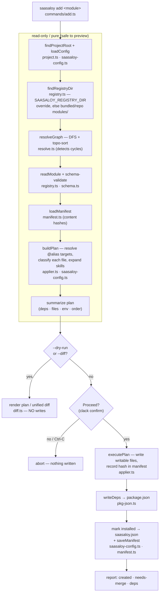
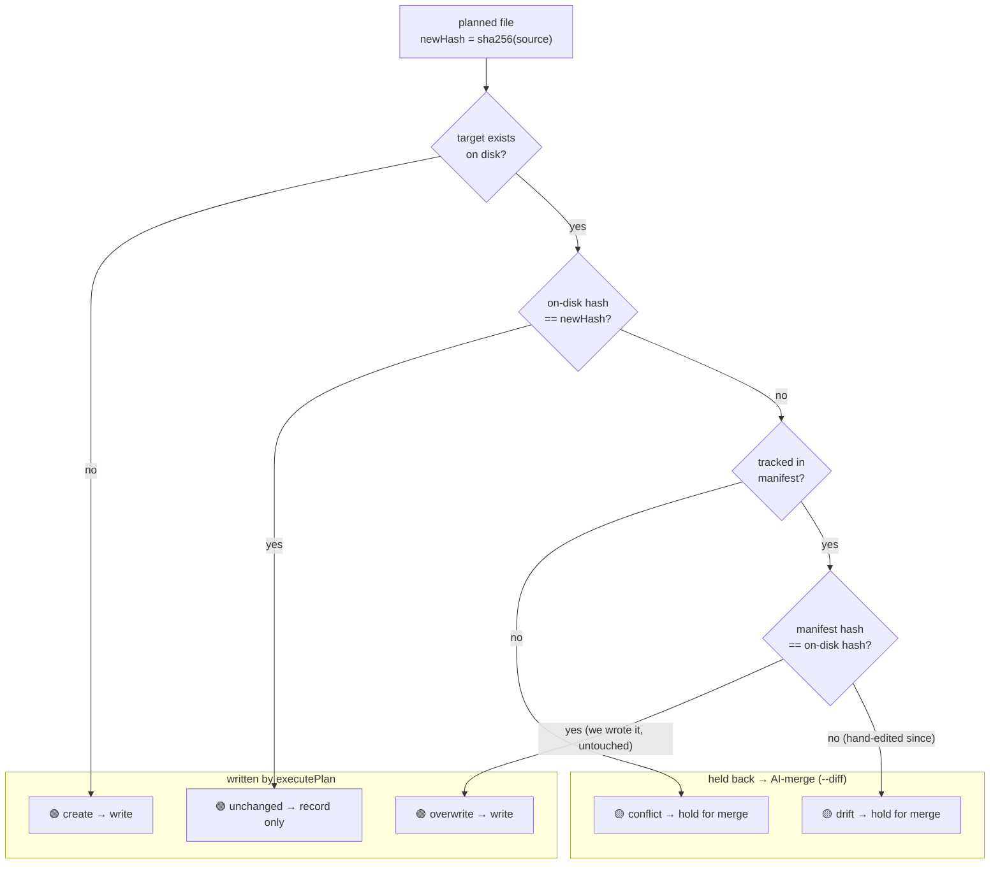

# QA Plan: Local applier engine (`saasaloy add`)

_Generated 2026-07-22 · covers the Phase 1 local applier (issue #6): `packages/cli/src/commands/add.ts` + new `lib/{applier,resolve,registry,saasaloy-config,pkg-json,diff}.ts`, exercised against a **throwaway registry you build under `.dev/`** (see Preconditions) — no committed example modules required_

## Summary

`saasaloy add <module>` reads a module descriptor off disk, resolves its `dependsOn`
graph (topologically, behind a confirmation prompt), drops files into alias-resolved
targets, records them in `.saasaloy/manifest.json` with content hashes, copies the
module's Claude skill folder(s), and merges npm deps into the project's `package.json`.
"Working" means: the plan is legible in a real terminal, the **interactive confirmation
prompt** gates the apply, files land where the alias map says, and a re-apply over a
hand-edited (drifted) file is held back for merge instead of clobbered.

This plan covers the **human-only** parts — the interactive prompt and the visual
readability of the clack TUI. The deterministic file/manifest/dep behavior was checked
by the agent and is recorded under **Automated verification**.

## How the engine works

`saasaloy add <module>` is a read → resolve → plan → **confirm** → apply pipeline. Each
stage lives in its own `lib/` module; the command (`commands/add.ts`) just orchestrates
them. Everything left of the confirmation prompt is pure/​read-only, so `--dry-run` and
`--diff` simply stop there and never touch the project.



**Per-file classification** is the heart of the update story (build spec §2.9): `buildPlan`
hashes the source file, compares against what's on disk *and* the manifest's record of
what the tool last wrote, and tags each file. `executePlan` writes the three "writable"
outcomes and holds `drift`/`conflict` back for an AI-merge instead of clobbering a human's
edit.



## Preconditions

- Branch `issue-6-local-applier-engine`, Node ≥ 24, pnpm 11.
- This plan is **self-contained**: it does not rely on any committed modules. You build a
  tiny throwaway registry under `.dev/` (the repo's gitignored dev sandbox) and point the
  engine at it with `SAASALOY_REGISTRY_DIR`. Two modules exercise the whole engine surface:
  - `hello` — a capability that drops one file to `@ui`.
  - `hello-widget` — a feature that `dependsOn: ["hello"]`, ships two files to `@web`, two
    npm deps (`zod`, `nanoid@5.0.7`), an env var, and a Claude skill.
  Both target only the base aliases (`@ui`, `@web`), so they apply into a stock playground
  with no edits.

### 1. Build the CLI

```sh
cd /Users/mukit/orca/workspaces/saasaloy/issue-6-local-applier-engine
pnpm --filter saasaloy build
```

### 2. Create the throwaway registry under `.dev/`

Paste this whole block from the repo root — it writes the two modules into
`.dev/registry/` (gitignored, disposable). `$schema` is omitted from the descriptors
because it's only an editor hint; the engine validates against its own compiled schema.

```sh
REG=.dev/registry
mkdir -p "$REG/hello/files/ui" \
         "$REG/hello-widget/files/web/components" \
         "$REG/hello-widget/skills/hello-widget"

cat > "$REG/hello/registry-item.json" <<'JSON'
{
  "name": "hello",
  "type": "saasaloy:capability",
  "files": [
    { "path": "files/ui/hello.ts", "target": "@ui/hello.ts" }
  ]
}
JSON

cat > "$REG/hello/files/ui/hello.ts" <<'TS'
export function hello(name: string): string {
  return `Hello, ${name}!`;
}
TS

cat > "$REG/hello-widget/registry-item.json" <<'JSON'
{
  "name": "hello-widget",
  "type": "saasaloy:feature",
  "dependsOn": ["hello"],
  "dependencies": ["zod", "nanoid@5.0.7"],
  "files": [
    { "path": "files/web/hello.ts", "target": "@web/hello.ts" },
    { "path": "files/web/components/HelloWidget.tsx", "target": "@web/components/HelloWidget.tsx" }
  ],
  "envVars": {
    "HELLO_GREETING": "Greeting the widget renders (defaults to \"Hello\")"
  },
  "agent": {
    "skills": ["skills/hello-widget"]
  }
}
JSON

cat > "$REG/hello-widget/files/web/hello.ts" <<'TS'
export function greeting(): string {
  return process.env.HELLO_GREETING ?? "Hello";
}
TS

cat > "$REG/hello-widget/files/web/components/HelloWidget.tsx" <<'TSX'
import { greeting } from "../hello.js";

export function HelloWidget({ name }: { name: string }) {
  return (
    <div className="hello-widget">
      {greeting()}, {name}!
    </div>
  );
}
TSX

cat > "$REG/hello-widget/skills/hello-widget/SKILL.md" <<'MD'
---
name: hello-widget
description: Worked-example module runbook, copied into .claude/skills/ by `saasaloy add hello-widget`.
---

# hello-widget

Example skill shipped to exercise the applier's agent-skill copy path (build spec §2.13).
MD
```

### 3. Point the engine at the registry and scaffold a playground

```sh
export SAASALOY_REGISTRY_DIR="$PWD/.dev/registry"
# Scaffold .dev/playground. At the "Install dependencies now?" prompt choose
# "No, I'll run it later" — `add` doesn't need node_modules, and it keeps setup fast.
node packages/cli/dist/index.js init .dev/playground --force
```

- Run every case from inside the playground; the CLI lives two levels up. **Keep
  `SAASALOY_REGISTRY_DIR` exported** in the shell you run cases from (re-export it with an
  absolute path if you open a new terminal):

```sh
cd .dev/playground
# each case: node ../../packages/cli/dist/index.js add <module> [flags]
```

> To reset between full passes, re-scaffold from the repo root:
> `rm -rf .dev/playground && node packages/cli/dist/index.js init .dev/playground --force`
> (choose "No" at the install prompt). The registry under `.dev/registry` can stay.

## Test cases at a glance

Priority legend: 🔴 Critical · 🟡 Normal · 🟢 Low

| # | Test case | Priority |
|------|-----------|----------|
| TC-1 | Confirmation prompt gates the apply — accept | 🔴 Critical |
| TC-2 | Confirmation prompt — decline aborts cleanly, nothing written | 🔴 Critical |
| TC-3 | Ctrl-C at the prompt cancels cleanly | 🟡 Normal |
| TC-4 | Drift "Needs merge" messaging is actionable | 🟡 Normal |
| TC-5 | Plan summary box is legible (order, files, deps, env) | 🟡 Normal |
| TC-6 | `--diff` output is readable (colors, +/-, truncation) | 🟡 Normal |
| TC-7 | Boxes render sanely in a narrow terminal | 🟢 Low |

## Test cases

### TC-1 — Confirmation prompt gates the apply — accept  ·  🔴 Critical
**Steps**
1. From a fresh `.dev/playground`, run (note: **no** `--yes`):

```sh
node ../../packages/cli/dist/index.js add hello-widget
```

2. Read the plan, then at the `Proceed?` prompt press `y` / Enter.

**Expected:** A `Proceed?` yes/no prompt appears *after* the plan and *before* any file
is written. Accepting applies the module — you see per-file `create` step lines, a
`Dependencies added` note, and an `Applied hello, hello-widget (4 files)` outro. The four
files now exist: `packages/ui/src/hello.ts`, `apps/web/src/hello.ts`,
`apps/web/src/components/HelloWidget.tsx`, `.claude/skills/hello-widget/SKILL.md`.
**Actual:** _(tester fills in)_

- [x] Pass
- [ ] Fail

### TC-2 — Confirmation prompt — decline aborts cleanly  ·  🔴 Critical
**Steps**
1. On a fresh playground, run the same command:

```sh
node ../../packages/cli/dist/index.js add hello-widget
```

2. At `Proceed?` choose **No** (`n`).

**Expected:** The command ends with `aborted — nothing applied`. No files were written —
`.claude/`, `.saasaloy/`, `apps/web/src/hello.ts` and the `components/` folder do not
exist, and `saasaloy.json` still shows `installed: ["web"]` only.
**Actual:** _(tester fills in)_

- [x] Pass
- [ ] Fail

### TC-3 — Ctrl-C at the prompt cancels cleanly  ·  🟡 Normal
**Steps**
1. Run `add hello-widget` (no `--yes`) on a fresh playground.
2. At the `Proceed?` prompt press **Ctrl-C**.

**Expected:** A clean `add cancelled` message (not a raw stack trace / unhandled
rejection). Nothing is written to the project.
**Actual:** _(tester fills in)_

- [x] Pass
- [ ] Fail

### TC-4 — Drift "Needs merge" messaging is actionable  ·  🟡 Normal
**Steps**
1. On a playground where the modules are already applied (finish TC-1 first), hand-edit a
   managed file to simulate a user change:

```sh
echo 'export const hello = "MY LOCAL EDIT";' > packages/ui/src/hello.ts
```

2. Re-apply the owning module with force:

```sh
node ../../packages/cli/dist/index.js add hello --force --yes
```

3. Read the `Needs merge` note, then confirm your edit survived:

```sh
cat packages/ui/src/hello.ts
```

**Expected:** The plan tags `packages/ui/src/hello.ts` as `drift → merge`; the run ends
`Applied hello (0 files)` with a `Needs merge` note telling you the file was left
untouched and to use `--diff` to merge. The `cat` still shows `MY LOCAL EDIT` — the tool
did **not** clobber your change. The message reads clearly enough that you know what to
do next.
**Actual:** _(tester fills in)_

- [x] Pass
- [ ] Fail

### TC-5 — Plan summary box is legible  ·  🟡 Normal
**Steps**
1. Run a dry run so no confirmation is needed:

```sh
node ../../packages/cli/dist/index.js add hello-widget --dry-run
```

2. Read the output boxes.

**Expected:** A `Dependencies` box reads `hello-widget requires: hello`. A `Plan` box
shows `will install: hello → hello-widget` (dependency before dependent), then one line
per file tagged `create`, then `4 file(s) to apply, 0 needing merge` and
`deps: zod, nanoid@5.0.7`. An `Env vars to set` box lists `HELLO_GREETING`. The run ends
`dry run — nothing applied`. Everything is aligned, nothing is cut off, and the ordering
reads correctly.
**Actual:** _(tester fills in)_

- [x] Pass
- [ ] Fail

### TC-6 — `--diff` output is readable  ·  🟡 Normal
**Steps**
1. On a fresh playground, run:

```sh
node ../../packages/cli/dist/index.js add hello-widget --diff
```

**Expected:** After the plan, each file gets its own titled box with a unified diff —
added lines prefixed `+` (green), removed `-` (red), context dim. For these fresh files
every line is a green `+`. The run ends `diff only — nothing applied` and writes nothing.
(To see a red/green mix and the `… N more lines` truncation, apply once, edit a managed
file, then `add hello --force --diff` — optional.)
**Actual:** _(tester fills in)_

- [x] Pass
- [ ] Fail

### TC-7 — Boxes render sanely in a narrow terminal  ·  🟢 Low
**Steps**
1. Resize the terminal to ~50 columns (or prefix `COLUMNS=50`), then run:

```sh
COLUMNS=50 node ../../packages/cli/dist/index.js add hello-widget --dry-run
```

**Expected:** The plan is still readable — long target paths may wrap or extend, but the
output isn't garbled into an unusable mess. (Perfect wrapping isn't required; this is a
polish check.)
**Actual:** _(tester fills in)_

- [x] Pass
- [ ] Fail

## Regression checks
- [x] `saasaloy init` still scaffolds a project (the applier didn't touch `init`).
- [x] `saasaloy list` and `saasaloy --help` still run without error.
- [x] `add hello-widget` twice in a row: the second run reports `already installed` and
      writes nothing.

## Automated verification (by AI agent)
_Checks the agent ran itself — no action needed from the tester; listed here for context and sign-off._

Commands run (gate + end-to-end against the throwaway `.dev/registry` above, pointed at
via `SAASALOY_REGISTRY_DIR`; the two negative-fixture cases add a `cyc-a`/`cyc-b` cycle
and a `bad` invalid descriptor to a second throwaway registry):

```sh
pnpm --filter saasaloy typecheck
pnpm --filter saasaloy build
# in .dev/playground, with SAASALOY_REGISTRY_DIR=$PWD/.dev/registry:
node <cli> add hello        --dry-run   # descriptor valid + resolves
node <cli> add hello-widget --dry-run   # descriptor valid + resolves + graph
node <cli> add hello-widget --yes       # apply + inspect manifest / saasaloy.json / package.json
node <cli> add hello-widget --yes       # idempotency
node <cli> add hello        --force --yes  # drift path (after hand-editing a managed file)
node <cli> add does-not-exist --yes     # unknown module
cd /tmp && node <cli> add hello --dry-run  # missing saasaloy.json
# negative-fixture registry:
SAASALOY_REGISTRY_DIR=<tmp> node <cli> add cyc-a --dry-run  # cycle
SAASALOY_REGISTRY_DIR=<tmp> node <cli> add bad   --dry-run  # invalid descriptor
```

- ✅ `typecheck` → `tsc --noEmit`, 0 TS errors.
- ✅ `build` → tsup ESM build success.
- ✅ Both descriptors (`hello`, `hello-widget`) validate against the real schema and
  resolve from the `SAASALOY_REGISTRY_DIR` registry.
- ✅ `add hello-widget --dry-run` → 0 files written; plan shows `will install: hello →
  hello-widget` (topo order, dependency first).
- ✅ `add hello-widget --yes` → 4 files created at alias-resolved targets
  (`packages/ui/src/hello.ts`, `apps/web/src/hello.ts`,
  `apps/web/src/components/HelloWidget.tsx`, `.claude/skills/hello-widget/SKILL.md`).
- ✅ Manifest → 4 managed entries; every recorded sha256 re-computed from the on-disk
  file **matches** (hash integrity OK).
- ✅ `saasaloy.json` `installed` → `web, hello, hello-widget` (topo order, dependency first).
- ✅ `package.json` deps → `{"nanoid":"5.0.7","zod":"latest"}` — pinned `nanoid@5.0.7`
  parsed to `5.0.7`, bare `zod` recorded as `latest`.
- ✅ Idempotent re-run → `already installed`, nothing re-written.
- ✅ Drift → `Applied hello (0 files)`; hand-edited `packages/ui/src/hello.ts` left as
  `HAND EDITED` (not clobbered), reported under `Needs merge`.
- ✅ Unknown module → `Unknown module "does-not-exist" — no does-not-exist/registry-item.json in the registry.`
- ✅ Missing config → `No saasaloy.json found in /private/tmp. Run \`saasaloy init\` first…`.
- ✅ Cycle → `Dependency cycle detected: cyc-a → cyc-b → cyc-a.`
- ✅ Invalid descriptor → `... has an invalid descriptor: /type: must be equal to one of
  the allowed values (saasaloy:capability, saasaloy:feature)`.

## Not covered / needs human judgment
- The **interactive confirmation prompt** accept/decline/Ctrl-C flow (TC-1–TC-3) — the
  agent can only drive `--yes`; a human at a real TTY must exercise the prompt itself.
- **Visual legibility** of the clack boxes, diff colors, and truncation (TC-5–TC-7) — a
  machine confirms the strings, not whether they *read well* in a terminal.
- **npm dependency routing** is out of scope for this engine: deps land in the project
  **root** `package.json` as `latest`/pinned; per-workspace routing and exact-version
  pinning wait on the capability modules (#8/#9). Not a bug in this plan's scope.
- **Config patches / scaffolds** are **not applied** here — that's the AST patch engine
  (issue #7). Modules declaring them only get a deferral warning.
- The throwaway modules target base aliases (`@ui`, `@web`) so they apply into a stock
  base. Applying into `@api`/`@db` needs those aliases registered by the real capability
  modules (#8/#9), which don't exist yet.
- **Registry distribution** — how a real npm-installed `saasaloy` finds its `modules/`
  registry — is tracked separately in issue #23 and is out of scope for this plan.
