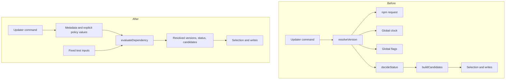

# Full-project refactor proposal

Created on 2026-09-07. Source revision is `0e7c7e3`. This document proposes changes for review.

## Coverage

Ranked 525 tracked files by churn. Confirmed reads cover 54 files across three areas, including 22 of the top 100 files.

The history window starts on 2025-09-06. Available history runs from 2026-07-21 through 2026-09-06, with 611 commits and 577 historical paths. The checkout is not shallow.

The survey covers the whole repository inventory. Code inspection uses full reads and selected sections, rather than a line-by-line review of all 525 files. All 19 module descriptors receive a full read. The appendix lists the 54 files included in the conservative read count.

Three agents inspect the CLI, modules and base, and maintainer tooling. The main session checks changes across areas and validates the selected findings. Additional agent reads without a complete path record do not increase the coverage count. The glossary, agent instructions, and architecture records provide the constraints and sit outside that count.

| Area | Confirmed files | Inspection scope |
| --- | ---: | --- |
| CLI, schemas, and tests | 12 | Update preparation, patch contracts, manifest validation, package contents, and module combinations |
| Modules and base | 31 | All descriptors, infrastructure translation, API and waitlist boundaries, and base composition |
| Maintainer tooling and configuration | 11 | Dependency selection, existing verification scripts, workspace settings, and CI |

Churn counts file appearances in the selected Git history. The top 100 current paths form the high-churn group. Pair counts exclude commits that touch more than 30 paths. This filter reduces the effect of broad formatting changes. Co-change counts guide inspection; they do not establish coupling by themselves.

The survey runs no tests, builds, dependency updates, or deployment commands. Test claims below describe the checked-in tests. They do not claim a passing run or measured coverage.

## Ranked improvements

| Rank | Candidate | Pattern | Strength | Files affected |
| --- | --- | --- | --- | --- |
| 1 | Separate dependency version policy from the updater command | Untested coupling | strong | 1 existing file and 2 new files |
| 2 | Share the patch-kind schema between descriptor and manifest validation | Poor locality | strong | 4 existing files and 1 new file |
| 3 | Separate infrastructure resource planning from execution | Untested coupling | moderate | 2 existing files and 2 new files |

The dependency policy is the recommended first change. It controls version selection across the base and module manifests. Its three-file scope removes network and clock setup from policy tests. The schema proposal removes repeated maintenance, but current parity tests already detect the known mismatch. Infrastructure planning has a useful test boundary, but its implementation changes only three times in the available history.

Strength describes the evidence and change scope, not defect severity. Both strong candidates affect high-churn files and name their complete initial scope. Every listed candidate passes both refactorkit gates.

## 1. Separate dependency version policy

### Problem and evidence

[`scripts/update-deps.ts`](../../scripts/update-deps.ts#L389) changes in 11 commits. Its `resolveVersion` function fetches npm metadata, reads `Date.now()`, and consults the global `flags.allowFresh` value. The function then selects eligible versions. `decideStatus` at line 627 and `buildCandidates` at line 931 apply further parts of the same policy.

The caller must coordinate resolution, status, and candidate creation. Tests must also control transport, time, and command options to exercise the current resolver. These dependencies make the version policy harder to check than its inputs require.

[`scripts/update-deps.test.ts`](../../scripts/update-deps.test.ts) covers the text write path, dependency paths, and a no-op edit across discovered manifests. It imports no resolver or candidate-selection interface. The current tests do not directly establish the cooldown or version-selection rules.

### Proposed structure

Add a pure `evaluateDependency` function in `scripts/dependency-policy.ts`. Give it the dependency specification, normalized npm metadata, and explicit policy values. Return the resolved versions, status, and available primary or major candidates.

```ts
evaluateDependency(dep, packument, {
  nowMs,
  minimumReleaseAgeMinutes,
  allowFresh,
})
// Returns { resolved, status, candidates }.
// Each candidate carries { kind: "primary" | "major", target }.
```

The policy owns stable-version selection, cooldown eligibility, and the decisions now spread across three functions. Its output also identifies whether a default update is actionable. The command continues to fetch metadata and supply the clock value. It formats the result and obtains the user's selection before writing.

The command supplies `Date.now()` at each evaluation to preserve the current timing boundary. A separate decision can later consider one fixed timestamp for an entire run. The policy reports major candidates; the command retains the existing major opt-in behavior.

The deeper interface hides the ordering between version resolution and candidate selection. A caller supplies facts and receives a complete decision. It does not need to reproduce eligibility rules to build the picker or decide the check result.



### Gate verdicts

Deletion test passes. Removing the scattered selection functions lets `evaluateDependency` own eligibility and candidate decisions, while the command retains transport and user interaction.

Interface as test surface passes. Tests call `evaluateDependency` with fixed metadata and time, then assert the complete decision without network requests or private helpers.

### Files affected

- Modify `scripts/update-deps.ts` to call the policy and preserve the current command output and flags.
- Add `scripts/dependency-policy.ts` to own the policy and its input and result types.
- Add `scripts/dependency-policy.test.ts` to check the policy through its exported function.

Keep the existing write tests. The existing `scripts/**/*.test.ts` command discovers the new test file. No runner or new dependency is necessary for this proposal.

### Validation and constraints

Use fixed inputs for the exact cooldown boundary, missing publication dates, and invalid dates. Cover prereleases, bare specifications, ranges, and exact pins that the current comparator cannot order. Check that primary candidates stay within the current major. Check the separate major candidate and the explicit fresh-release override. Verify the existing actionable-status rule for `deps:check`.

[`ADR 0016`](../adr/0016-adr-in-script-cooldown-gate-for-invisible-manifests-2026-07-24.md) remains in force. The three-day cooldown, exact pins, independent manifest resolution, and major opt-in stay unchanged. The [JSON write plan](../plans/0039-plan-deps-update-in-place-json-2026-08-31.md) already separates text edits from command execution. This proposal applies a similar test boundary to version selection and leaves those text edits intact.

The main implementation risk is changing selection behavior while extracting it. Fixed input and output cases must establish the current rules before the command adopts the function.

## 2. Share the patch-kind schema

### Problem and evidence

[`registry-item.schema.json`](../../packages/cli/schemas/registry-item.schema.json) and [`manifest.schema.json`](../../packages/cli/schemas/manifest.schema.json) each declare the same six patch kinds. The patch engine also declares its typed set. [`schema.test.ts`](../../packages/cli/src/lib/schema.test.ts#L32) navigates both schema objects to compare their enums against `PATCH_KINDS`.

Commit `962db03` records a concrete failure from this duplication. The descriptor accepted patch kinds that the manifest rejected on its next load. That commit aligns the lists and adds regression tests. Commit `c9d4d00` changes both schemas again when it adds reversible module patches.

The broader descriptor schema and TypeScript view change together in nine commits after the large-commit filter. Their churn counts are 16 and 12. This proposal targets only repeated patch-kind membership. Other descriptor fields can have different authored and persisted contracts.

The current parity and manifest reload tests address the known failure. The remaining cost is that every patch kind requires duplicate JSON edits and tests tied to schema layout.

### Proposed structure

Add `packages/cli/schemas/patch-kind.schema.json` with one patch-kind enum. Both existing schemas reference that definition. The validator loader registers the shared schema from the package before compiling either consumer.

Keep descriptor payload checks separate from manifest checks. Existing manifest tests intentionally accept recorded patches with only `file` and `kind`. Sharing the complete descriptor schema would tighten that contract and exceed this proposal.

The deeper interface gives both schema consumers one membership definition. Patch authors maintain one JSON enum instead of two. Retain the typed engine set and its parity check, because it serves a different compiler contract.

### Gate verdicts

Deletion test passes. Removing both inline enum copies lets the descriptor and manifest validators consume one definition without transferring membership rules to their callers.

Interface as test surface passes. Public validator calls and manifest save/load tests establish accepted kinds and unknown-kind refusal without inspecting nested schema properties.

### Files affected

- Add `packages/cli/schemas/patch-kind.schema.json`.
- Modify `packages/cli/schemas/registry-item.schema.json` to reference the shared definition.
- Modify `packages/cli/schemas/manifest.schema.json` to reference the shared definition.
- Modify `packages/cli/src/lib/schema.ts` to register the local shared schema before compilation.
- Modify `packages/cli/src/lib/schema.test.ts` to check behavior and parity without depending on both inline enum locations.

The existing package rule, `schemas/*.schema.json`, includes the new file. Consumer commands keep their current validation calls. Existing manifest reload tests remain relevant without a new persistence format.

### Validation and constraints

Check every supported kind through both public validators. Check an unknown kind through both validators. Retain the manifest reload cases and the engine parity check. Verify local reference resolution from both source and packaged CLI paths. Verify that schema references do not require a network request.

[`ADR 0010`](../adr/0010-adr-config-patch-magicast-jsonc-parser-2026-07-22.md) and [`ADR 0019`](../adr/0019-adr-module-patches-applied-flat-array-2026-07-24.md) remain in force. The patch engine and flat patch format stay intact. The main risk is broken schema reference resolution, which the packaged-path check must settle.

## 3. Separate infrastructure resource planning

### Problem and evidence

[`translate.ts`](../../modules/infra/files/src/translate.ts#L39) builds the service and reads its bundle before checking supported binding keys. Its configuration loop both validates keys and constructs Pulumi D1 resources. The returned result contains Pulumi resource objects.

This interface combines binding policy with process execution, bundle files, and Pulumi resource construction. A test of an unsupported key reaches the build before it reaches the policy. Tests of D1 resource names also need the execution dependencies.

The module file inventory contains no infrastructure behavior test. The [module matrix](../../packages/cli/test/matrix/combinations.test.ts) checks descriptor combinations and collisions. It does not execute infrastructure translation. `translate.ts` changes in three commits, so this candidate has moderate strength.

### Proposed structure

Add a pure `planService(service)` function that returns the complete resource description or an unsupported-key error. The description names the Worker, D1 resources, and bindings. It carries no Pulumi objects.

Make `toResources` obtain that plan before building the service. It then reads the bundle and constructs the corresponding Pulumi resources. Keep its existing caller and return signature.

The deeper interface concentrates supported binding rules and resource naming in one testable operation. The executor consumes a validated description. It no longer combines rule checks with resource construction inside the same loop.

### Gate verdicts

Deletion test passes. Removing inline binding translation lets `planService` own acceptance and naming, while `toResources` retains execution behind the caller's existing deployment operation.

Interface as test surface passes. Tests assert a complete resource plan or refusal from configuration data without private helpers, pnpm, bundle files, or Pulumi.

### Files affected

- Modify `modules/infra/files/src/translate.ts` to consume the plan.
- Modify `modules/infra/registry-item.json` to install the new planner file.
- Add `modules/infra/files/src/plan.ts`.
- Add `modules/infra/files/src/plan.test.ts` for repository tests.

The descriptor installs the planner but does not need to install its test. `modules/infra/files/index.ts` keeps its current call to `toResources`. The existing module test command discovers the new `.test.ts` file.

### Validation and constraints

Check D1 resource names and plain-text variable bindings through the planner. Check Worker compatibility fields and unsupported keys. Confirm that unsupported configuration stops before the build starts. Use a separate integration check to establish that the executor constructs resources matching the plan.

[`ADR 0021`](../adr/0021-adr-pulumi-iac-engine-for-infra-2026-07-25.md) remains in force. Infrastructure keeps Pulumi and owns the translation from Wrangler configuration. This proposal changes where validation happens inside that boundary. It does not propose a new deployment provider.

The main risk is disagreement between planned data and constructed resources. Planner tests alone do not establish deployment correctness.

## Handoff

Review candidate 1 with `/grillkit docs/refactor/0001-refactor-full-project-2026-09-07.md`.

Check its assumptions and failure paths. Confirm the three-file scope before implementation. Use `implementkit` after the proposal is settled.

Consider the other candidates in rank order. Use `domainkit` for a superseding record if a later design changes an accepted decision. None of the proposals above currently requires a superseding record.

This survey adds only this report. It changes no source file and creates no commit.

## Appendix: confirmed read set

The count includes full reads and selected sections. A path appears once. Listing a path does not claim an exhaustive review of that file.

### CLI, schemas, and tests: 12 files

```text
packages/cli/src/commands/update.ts
packages/cli/src/commands/update.test.ts
packages/cli/src/lib/updater.ts
packages/cli/src/lib/schema.ts
packages/cli/src/lib/schema.test.ts
packages/cli/src/lib/manifest.test.ts
packages/cli/src/lib/patch/index.ts
packages/cli/schemas/registry-item.schema.json
packages/cli/schemas/manifest.schema.json
packages/cli/package.json
packages/cli/tsup.config.ts
packages/cli/test/matrix/combinations.test.ts
```

### Modules and base: 31 files

All 19 `modules/*/registry-item.json` files belong to this count. The other 12 paths follow.

```text
modules/infra/files/src/translate.ts
modules/infra/files/src/discover.ts
modules/infra/files/index.ts
modules/infra/files/package.json
modules/api/files/src/index.ts
modules/waitlist/files/api/routes/waitlist.ts
modules/waitlist/files/web/components/WaitlistForm.tsx
packages/cli/templates/base/AGENTS.md
packages/cli/templates/base/apps/web/src/pages/index.astro
packages/cli/templates/base/packages/ui/src/index.ts
packages/cli/templates/base/packages/ui/package.json
packages/cli/templates/base/package.json
```

### Maintainer tooling and configuration: 11 files

```text
scripts/update-deps.ts
scripts/update-deps.test.ts
scripts/verify-pins.ts
scripts/verify-content.ts
scripts/verify-preset.ts
scripts/watch-template.ts
package.json
pnpm-workspace.yaml
turbo.json
tsconfig.scripts.json
.github/workflows/ci.yml
```
