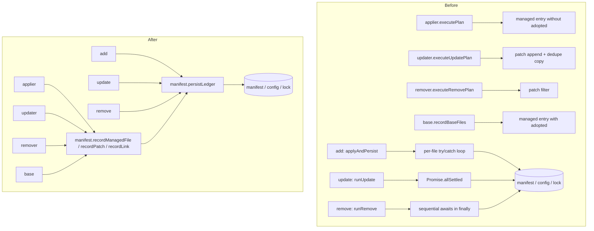

# Full-project refactor proposal

Grilled: 2026-09-16

Created on 2026-09-15. Source revision is `16740df`. This document proposes structural changes for review. It touches no source file.

It follows [0001](0001-refactor-full-project-2026-09-07.md), the survey from 2026-09-07. Of that survey's three candidates, the dependency policy split landed as `scripts/dependency-policy.ts`, the shared patch-kind schema is still open and carries forward below as candidate 6, and the infrastructure planning split stays out because `modules/infra` did not change since.

## Coverage

Ranked 787 tracked files (533 code files) by churn across 761 commits, from 2026-07-21 to 2026-09-15, excluding commits that touch more than 30 files. Read about 60 files in full and 20 more in part, across four areas: the CLI commands, the CLI library and schemas, the modules, and the base template with the maintainer scripts. Four subagents read the areas; the main session derived the co-change pairs, verified every claim behind the crowned candidate against the working tree, and dropped nothing an agent reported with both gate verdicts stated.

| Area | Hot files (churn count) | Read in full |
| --- | --- | --- |
| CLI commands | `add.ts` 36, `init.ts` 21, `update.ts` 12, `remove.ts` 12 | 9 |
| CLI library and schemas | `applier.ts` 25, `registry-item.schema.json` 17, `schema.ts` 13, `patch/index.ts` 13, `manifest.ts` 12, `updater.ts` 11, `remover.ts` 10 | 11 |
| Modules | `auth/files/src/auth.ts` 11, `api/files/src/index.ts` 13, `admin/registry-item.json` 11, the two-week tenancy set | 35 |
| Template and scripts | `update-deps.ts` 11, `oxlint.config.mjs` 12, the three template `package.json` files 11 to 13 | 6 full, 11 partial |

The strongest co-change pairs outside test-to-source pairs are `add.ts` with `applier.ts` (12), `registry-item.schema.json` with `schema.ts` (10), `registry-item.schema.json` with `applier.ts` (9) and with `add.ts` (8), and `applier.ts` with `manifest.ts` (6). One descriptor field, `onlyWith` in commit `fcf9628`, changed 9 CLI files. That fan-out is the poor-locality evidence behind candidates 1, 2, 6 and 10.

The survey ran no tests and no build. Test claims describe the checked-in tests.

## Ranked candidates

Strength follows the refactorkit scale: `strong` means both gates pass, the files are in the churn top slice, and the blast radius is named in files. `moderate` means both gates pass but the code is cold or the blast radius is wide. `weak` means the gates pass but nothing changes about what a caller must know. Every listed candidate passes both gates.

| Rank | Candidate | Pattern | Strength | Blast radius |
| --- | --- | --- | --- | --- |
| 1 | **One ledger for the manifest, config and lock** (crowned) | untested coupling | strong | 8 existing files, 1 new |
| 2 | One tracked-file verdict for applier, updater and remover | adapter prevalence | strong | 3 existing files, 1 new |
| 3 | A refusal travels as a code, not a message string | adapter prevalence | strong | 5 files, 2 admin screens |
| 4 | Split the api-key scope guard into a pure rules file | untested coupling | strong | 2 files, 1 descriptor entry |
| 5 | One confirm-or-refuse gate for add, update and remove | untested coupling | strong | 4 files |
| 6 | Share the patch-kind schema (carried from 0001) | adapter prevalence | strong | 5 files, 0 callers |
| 7 | `update-deps.ts` imports the CLI's terminal helpers | untested coupling | strong | 3 files |
| 8 | One skill-link planner for applier and updater | untested coupling | moderate | 2 files |
| 9 | One plan and result renderer for the three commands | adapter prevalence | moderate | 6 files |
| 10 | Derive the descriptor types from the schema | poor locality | moderate | 3 files, wide test change |
| 11 | One argv splitter for nine commands | shallow interface | moderate | 10 files |
| 12 | Scaffold the capability-core contract once | untested coupling | moderate | 12 core files, 4 tests |
| 13 | Export the `verify-content` scanner and test it | untested coupling | moderate | 2 files |
| 14 | One `name@version` parser inside `update-deps.ts` | adapter prevalence | weak | 1 file |

Candidate 1 is crowned. It fixes a live divergence, it sits on the hottest seam in the repo, and every later candidate on the CLI side (2, 6, 8, 10) writes through it. Candidate 2 is the natural second step and shares two of its files.

## 1. One ledger for the manifest, config and lock (crowned)

### Problem and evidence

Three state files describe what Saasaloy wrote into a project: `.saasaloy/manifest.json`, `saasaloy.json` and `saasaloy-lock.json`. The rule "the ledger describes disk even after a throw" is stated at three write sites and implemented three different ways.

- `packages/cli/src/commands/add.ts:473-487` loops the three saves with a per-file `try/catch`, collects failures and warns.
- `packages/cli/src/commands/update.ts:1025-1042` runs the three saves through `Promise.allSettled` with a comment that sequential awaits "would let a failed manifest save skip the config and lock".
- `packages/cli/src/commands/remove.ts:357-363` awaits the three saves in sequence inside a `finally`, under a comment that says "same rationale as `add`". That is the sequence the update comment says must not happen.

The record shape is also re-derived at every mutation site instead of owned by `manifest.ts`, which today exports only types, `loadManifest`, `saveManifest` and `samePatchEntry`.

- `lib/applier.ts:865-874` and `lib/updater.ts:1226-1235` are the same eight lines: build a `ManifestPatch`, dedupe by `samePatchEntry`, push.
- `lib/remover.ts:506-508` is the inverse filter.
- `lib/applier.ts:838-842` writes a managed entry as `{ module, hash, from }`. `lib/base.ts:244-248` writes `{ module, hash, adopted?, from }`. The rule "adopted is dropped the first time the tool writes the file itself" lives in prose at `lib/manifest.ts:22-29` and is implemented by omission at one site and by a spread at the other.
- `lib/applier.ts:896` and `lib/updater.ts:1246` are the same line, `manifest.links[link.target] = link.path`.

`remove.test.ts` covers the picker and the TTY path only. No test asserts that a failing manifest save still writes the config and the lock, because the only way to reach the rule today is a full command run against a temp project and a temp registry.

### Proposed shape

The ledger has two halves in two files. This section carries the decisions from the grill on 2026-09-16.

The record half stays in `packages/cli/src/lib/manifest.ts` as pure mutations on a plain `Manifest`: `recordManagedFile(manifest, { module, target, hash, from, adopted? })`, `untrackManagedFile`, `recordPatch` with the `samePatchEntry` dedupe inside, `untrackPatch`, `recordLink` and `untrackLink`. `base.recordBaseFiles` at `lib/base.ts:232-250` is the existing precedent for a named writer. The record half covers the manifest only. `config.installed` stays with `saasaloy-config.ts` and lock entries stay with `lock.ts`, because neither shape has diverged.

The `adopted` flag is one optional field written only when true. A real write passes nothing, so the flag drops by construction, which is the rule `manifest.ts:22-29` states in prose. Only `base.recordBaseFiles` and the adopt path pass `true`.

The persist half is a new `packages/cli/src/lib/ledger.ts` exporting `persistLedger({ root, manifest, config, lock })`. `manifest.ts` keeps no import of the config or the lock. The persist half writes what it is given: callers mutate the three structures in memory first, and `add` keeps its guarded `upsertLock` in `applyAndPersist` so the provenance rule never enters the ledger. The `add` rule from issue #49 becomes the one rule: the three saves run in sequence, every save runs even when an earlier one fails, and each failure is collected. The function returns `{ file, error }[]` and prints nothing. The command prints the warnings and decides the exit: an apply error wins, and a save failure on a clean apply is thrown after all three saves ran.

```ts
// lib/manifest.ts (record half)
recordManagedFile(manifest, { module, target, hash, from, adopted });
recordPatch(manifest, entry);            // dedupes by samePatchEntry
untrackPatch(manifest, entry);
recordLink(manifest, target, path);

// lib/ledger.ts (persist half)
const failures = await persistLedger({ root, manifest, config, lock });
// failures: { file: string; error: unknown }[]
```

`executePlan`, `executeUpdatePlan`, `executeRemovePlan` and `recordBaseFiles` call the record half. `applyAndPersist`, `runUpdate` and `runRemove` call the persist half. Candidate 8's link record folds in here; candidate 2 takes its own grill later.

### Why it is deeper

A caller today must know the record shape, the `adopted` rule, the dedupe rule and the save-ordering rule, and must reproduce all four correctly. After the change a caller supplies facts and the ledger owns the invariants. The interface shrinks to six mutations and one persist call, and the behaviour behind it is the whole bookkeeping contract of ADR 0006, ADR 0031 and ADR 0034.



### Gate verdicts

Deletion test passes. If the ledger vanished, the four executors would re-derive the record shape and the three commands would re-state the save rule, which is today's state. Concentrating puts the `adopted`, dedupe and save-ordering rules in one file instead of seven sites that already disagree.

Interface as test surface passes. Each record call is a pure mutation of a plain `Manifest`, assertable the way `base.test.ts` already tests `recordBaseFiles`. The persist rule "a failing save of one file does not skip the other two, and the apply error still wins" is assertable against an injected failing writer with no temp project, registry or descriptor.

### Blast radius

- Modify `packages/cli/src/lib/manifest.ts` to add the record half.
- Add `packages/cli/src/lib/ledger.ts` for the persist half.
- Modify `packages/cli/src/lib/applier.ts`, `lib/updater.ts`, `lib/remover.ts` and `lib/base.ts` to call the record half.
- Modify `packages/cli/src/commands/add.ts`, `commands/update.ts` and `commands/remove.ts` to call the persist half. `add.ts` loses the save loop in `persistState` and keeps the guarded `upsertLock`.
- Move the `persistState` failure-injection tests from `commands/add.test.ts:970` onward into a new `lib/ledger.test.ts`. Add record-mutation tests to `lib/manifest.test.ts`. The three command test files shrink.

Callers changed: 7. `doctor.checkPartialInstalls` reads the manifest and is unaffected.

### Delivery

One pull request carries both halves. It needs no new ADR. The body cites ADR 0006, ADR 0031 and ADR 0034 as the rules it concentrates, and it names the one behaviour change: `remove` no longer lets a save throw mask the apply error, and all three saves run on every exit.

### Constraints

ADR 0006 (manifest hash tracking), ADR 0019 (patches stay a flat recorded array), ADR 0031 (a re-run recovers a partial add) and ADR 0034 (update never writes a file it did not write) all stay in force. The ledger enforces them. Issue #49 settled the failure model for `add` and is closed; this proposal extends that model to `update` and `remove` and adds no transactionality.

The main implementation risk is the behaviour change in `remove` on a failed save. Today a throw from `saveManifest` inside the `finally` masks the original apply error and skips the config and lock. After the change the apply error wins and all three saves run, which is the `add` behaviour.

## 2. One tracked-file verdict for applier, updater and remover

### Problem and evidence

Three engines each decide "is this still the file Saasaloy wrote" by comparing a disk hash to the manifest hash, and each re-checks before writing.

- `lib/applier.ts:437`: `action: managed.hash === oldHash ? "overwrite" : "drift"`, in the private `classify`.
- `lib/updater.ts:939`: `return hashContent(mine) === managedHash ? "overwrite" : "drift"`, in the private `classifyUpdate`.
- `lib/remover.ts:370`: `return hashContent(content) === manifestHash ? "delete" : "drift"`, in the exported `classifyTrackedFile`.
- `stillMatches` at `applier.ts:791`, `updater.ts:1123` and `recheckFile` at `remover.ts:398` are the re-read-before-write guard, three times.
- `updater.ts:349` already maps the remover's verdicts into the updater's vocabulary through `DELETE_ACTION`, which shows the shapes can be mapped.

Only the remover's classifier is unit-tested as a function (`remover.test.ts:69-80`). The applier's and updater's are reachable only through a temp project, a module folder and a manifest (`applier.test.ts:36-88`).

### Proposed shape

One `packages/cli/src/lib/tracked-file.ts` owning `classifyAgainstManifest(disk, manifestEntry, newHash, owner)` and one `stillMatches(planned)`. Each engine maps the verdict onto its own action vocabulary (`create/overwrite/drift/conflict`, `skip/restore/delete-drift`, `delete/drift/missing`) the way `DELETE_ACTION` does today.

### Why it is deeper

The manifest-ownership gate of ADR 0034 and the `adopted` rule become one decision with one test, and the three vocabularies stay where the commands need them.

### Gate verdicts

Deletion test passes. Removing the unit sends the hash-versus-manifest rule back into `buildPlan`, `planOneModule` and `buildRemovePlan`, which is today's triplication.

Interface as test surface passes. The verdict is a pure function of disk content, manifest entry, new hash and the adopted and project-owned flags, already tested in that form for the remover.

### Blast radius

`lib/applier.ts`, `lib/updater.ts`, `lib/remover.ts`, new `lib/tracked-file.ts`. Callers changed: 6, the build and execute pair in each engine. ADR 0006, ADR 0031 and ADR 0034 are constraints, not reversals.

## 3. A refusal travels as a code, not a message string

### Problem and evidence

The api side mints a structured refusal, `Denial { status, message }` at `modules/auth/files/src/authorize.ts:55-58`, but the envelope in `modules/api/files/src/index.ts:61-67` derives `error.code` from the status alone. So `forbidden` covers both "pick an organization first" and "you may not do this". The admin SPA reshapes the prose back into a decision.

- `modules/rbac/files/admin/routes/roles.tsx:98` and `modules/api-keys/files/admin/routes/api-keys.tsx:77` both read `error.message === "no active organization"`.
- `modules/multitenant/files/auth/tenant-rules.ts:38` exports the string with the comment "Change it here and change the SPA in the same commit."
- `modules/admin/files/src/lib/auth.ts:32-37` carries the browser's hand copy of `ADMIN_ROLES` across the same boundary.

### Proposed shape

`Denial` carries an optional `code`. `errorFor` in the api envelope writes it into the slot `ErrorBody.error.code` already has. The two screens and `rbac/files/admin/lib/tenant.ts` read `error.code === "no_active_organization"`.

### Gate verdicts

Deletion test passes. The per-screen string matching goes away, and the decision concentrates in `tenant-rules.ts` and `errorFor` where the denial is minted.

Interface as test surface passes. The mapping becomes a pure assertion in `tenant-rules.test.ts`, which already pins the string, instead of a branch reachable only with a signed-in browser, a running api and a database.

### Blast radius

`tenant-rules.ts`, `api/files/src/index.ts`, `roles.tsx`, `api-keys.tsx`, `rbac/files/admin/lib/tenant.ts`. Callers changed: 2 screens and 1 query helper. `ERROR_CODES` stays status-derived by default. No ADR reversed.

## 4. Split the api-key scope guard into a pure rules file

### Problem and evidence

Every other authorization rule in the tenancy set is split into a zero-import `*-rules.ts` with a `node --test` beside it (`rbac-rules.ts`, `tenant-rules.ts`, `authorize.ts`). The privilege-escalation gate on key issue is not. `apiKeyScopeGuard` at `modules/api-keys/files/auth/plugins/api-key.ts:186-281` keeps its whole decision inside a Better Auth `before` hook that needs the Workers env, the adapter, a live session and a `member` row.

The hook has four silent allow paths and no test covers any of them: `if (!scope) return`, `if (!session) return`, `typeof organizationId !== "string"` then return, and `if (!membership) return` at line 258. `scopeOf` at lines 135-154 also re-implements `parsePermission` from `tenant-rules.ts:162-181` with a different empty-case answer.

### Proposed shape

A new `modules/api-keys/files/auth/api-key-rules.ts` with `scopeOf` and a pure `decide(scope, roleKind, statements)`. The hook keeps only the session and adapter reads and calls `decide`.

### Gate verdicts

Deletion test passes. The hook absorbs one call, and the decision sits next to `can()` instead of across a hook body, a `guardContext` shim and three early returns.

Interface as test surface passes. Each allow path becomes an argument to a pure function, tested the way `rbac-rules.test.ts` tests `can()`.

### Blast radius

`plugins/api-key.ts`, new `api-key-rules.ts` with its test, one `files[]` entry in the descriptor. Callers changed: 0. ADR 0036 stays, the scope still travels as `metadata.scope`. Whether a fail-open path is a defect is a separate question for the owner; this proposal only makes it visible to a test.

## 5. One confirm-or-refuse gate for add, update and remove

### Problem and evidence

The rule "a closed stdin is not a no" is stated in `add.ts:610-621` and `update.ts:549-556` with a byte-identical message, and its origin story sits in the add comment at lines 603-607. `remove.ts:336-337` calls `confirm` with no TTY guard at all, while `remove.ts:242-248` guards the picker and says "same hazard as `add`". So `saasaloy remove waitlist </dev/null` takes the closed stream as a cancel.

### Proposed shape

One `confirmOrRefuse({ yes, preview, label })` in `packages/cli/src/lib/tui.ts` returning `applied | aborted | refused`, called by the three commands.

### Gate verdicts

Deletion test passes. Three commands absorb one call and the rule stops being restated in three wordings.

Interface as test surface passes. The rule becomes a pure function over `{ yes, preview, isTTY }` plus an injected prompt.

### Blast radius

`lib/tui.ts`, `add.ts`, `update.ts`, `remove.ts`. Callers changed: 3.

## 6. Share the patch-kind schema (carried from 0001)

### Problem and evidence

The state has not moved since the 0001 survey. `registry-item.schema.json:153-165` and `manifest.schema.json:92-102` each spell the same seven-value enum, `patch/index.ts:100-128` holds the typed union, and `schema.test.ts:33-52` navigates both schema objects by path to keep them equal. The two sides also disagree on payload strictness: the descriptor validates payloads per kind at `registry-item.schema.json:169-300`, the manifest record validates only `file` and `kind`, so a recorded patch that `remove` will replay is never payload-checked on reload.

### Proposed shape

Add `packages/cli/schemas/patch-kind.schema.json` with one enum. Both schemas `$ref` it and `schema.ts` registers it before compiling. Keep the payload rules separate, as 0001 argued.

### Gate verdicts

Deletion test passes. Removing the shared enum returns the two inline copies plus the TS table, which is today.

Interface as test surface passes. Accepted and refused kinds are provable through `validateRegistryItem` and `validateManifest` alone.

### Blast radius

New `patch-kind.schema.json`, `registry-item.schema.json`, `manifest.schema.json`, `schema.ts`, `schema.test.ts`. Callers changed: 0. ADR 0019 stays.

## 7. `update-deps.ts` imports the CLI's terminal helpers

### Problem and evidence

`scripts/update-deps.ts:568-612` carries a hand copy of `stripAnsi` and `wrapForNote` from `packages/cli/src/lib/tui.ts:12-66`, with the stated reason that importing "would drag in a build step". `tsconfig.scripts.json` already sets `allowImportingTsExtensions`, `tui.ts` has zero imports, and the scripts run under Node 24 type stripping. The copy is reachable by no test (`update-deps.test.ts:21-28` imports five other names), and it costs a second `no-control-regex` suppression explained in `oxlint.config.mjs:110-114`.

### Proposed shape

Delete the copy and import from `packages/cli/src/lib/tui.ts`.

### Gate verdicts

Deletion test passes. The one caller, the report and picker rendering in `update-deps.ts`, absorbs an import.

Interface as test surface passes. `tui.test.ts` already asserts the behaviour; the script inherits it.

### Blast radius

`scripts/update-deps.ts`, `oxlint.config.mjs`, one comment in `tui.ts`. Callers changed: 1. ADR 0011 and ADR 0016 stay.

## 8. One skill-link planner for applier and updater

`lib/applier.ts:633-655` inline in `buildPlan` and `lib/updater.ts:943-970` in `planLinks` derive the same `.claude/skills` to `.agents/skills` link and share the same `missing/correct/conflict` ternary verbatim. One `planSkillLinks(root, module, agentSkills)` in the applier, called by both, puts the ADR 0015 naming rule in one place. Deletion test passes (deleting it re-inlines the same derivation twice). Test surface passes (a bare temp dir suffices, no registry or manifest). Blast radius: 2 files, 2 callers. Moderate because the win is small on its own; it folds naturally into candidate 1's `recordLink`.

## 9. One plan and result renderer for the three commands

`add.ts:154-302`, `update.ts:188-350` and `remove.ts:98-204` each hold label maps, a diff renderer capped at the same 60 lines, and a plan summary. The closing sentence `${n} file(s) to apply, ${m} needing merge` is computed by two unrelated filters in add and update. A shared `FileOutcome` vocabulary plus one `lib/plan-report.ts` makes the plan wording assertable from a fixture. Deletion test passes (the three blocks collapse, and each command absorbs one `note(renderPlan(plan))`). Test surface passes (the renderer is pure over a plan struct). Blast radius: 6 files, 3 callers. Moderate because the three vocabularies genuinely differ, so the work is reconciling the shape, and it reaches three library modules. ADR 0034 requires the `drift` and `conflict` verdicts to stay distinguishable.

## 10. Derive the descriptor types from the schema

`registry-item.schema.json` and `lib/schema.ts` change together in 10 commits, and one descriptor field changed 9 CLI files. The TypeScript view of a descriptor is mirrored by hand from the JSON schema. Deriving the type from the schema, or the schema from one typed source, makes a new field one edit. Deletion test passes (the hand mirror vanishes and the one schema absorbs it). Test surface passes (`validateRegistryItem` narrows the type). Blast radius: `schema.ts`, `registry-item.schema.json`, the build, and wide test churn. Moderate because it needs a type-level dependency choice, which is a decision for a plan, and because ADR 0010 chose the validation stack. Candidates 1, 2, 6 and 8 each shorten the fan-out on their own.

## 11. One argv splitter for nine commands

`add.ts:110-130`, `init.ts:81-101` and `remove.ts:77-96` have byte-identical loop bodies including `unknown.push(...positional.slice(1))`, and six more commands carry the collapsed variant. The rule "a typo'd flag is reported, never ignored" is one rule by copy. One `splitArgv(argv, { known, valueFlags, positionals })` in `lib/args.ts` concentrates it. Deletion test passes narrowly. Test surface passes (pure). Blast radius: 10 files, 9 callers. Moderate because each command keeps its own options mapping, so part of the code relocates.

## 12. Scaffold the capability-core contract once

`define<Cap>({ providers })`, `create<Cap>(env)`, the `<CAP>_PROVIDER` selector and the normalized error class are implemented six times with the capability name substituted (`email`, `sms`, `kv`, `queue`, `storage`, `billing`). Six copies of the "provider is not set" throw exist, and `sms/provider.ts:181` is the one that diverged on `retryable`. `email` and `sms` ship no `define.test.ts`, while four other cores test the same selector. A shared runtime package would break the rule in AGENTS.md that a core has zero runtime dependencies, and would strain the copy-in distribution of ADR 0005 and ADR 0006. The honest home is the `create-module` scaffold emitting one generated file plus one generated test. Deletion test passes with that caveat. Test surface passes. Blast radius: 12 core files, 4 duplicated tests, 0 callers. Moderate because the cores are cold and the blast is wide. `logger` stays the declared exception.

## 13. Export the `verify-content` scanner and test it

`scripts/verify-content.ts:204-316` is a pure text scanner, but its rules are provable only by running the script against the real base template, so it grew an inline self-test harness at lines 318-372 that executes on every invocation. `verify-pins.ts:171-176` shows the repo's own pattern: export the pure functions and guard the driver with a direct-run check. Deletion test passes. Test surface passes (every fixture is string in, findings out). Blast radius: the script and a new `verify-content.test.ts`; `pnpm verify:content` keeps its contract. Moderate because the file is cold and run by hand.

## 14. One `name@version` parser inside `update-deps.ts`

`update-deps.ts:419-421`, `1133-1136` and `1144-1149` split and join the descriptor's `name@version` entry grammar three times, and `packages/cli/src/lib/pkg-json.ts:17-21` holds a fourth with a different `latest` fallback. One `parseDepEntry` and `formatDepEntry` pair concentrates the script-side triple. Weak, because nothing changes about what a caller must know, and the deeper disagreement between the array form and the object form cannot be resolved without reversing ADR 0017.

## Dropped on the gates

These were considered and left out because deleting the unit would relocate complexity rather than concentrate it, or because a decision record already settles the shape.

- The `COMMANDS` registry in `commands/index.ts`: `cli.ts` would absorb a hand-maintained switch that help and picker both re-derive.
- The `ModuleUpdateInput` options object in `updater.ts:487-521`: narrowing it reverses ADR 0032.
- A shared recursive `readdir` across `update-deps`, `verify-css` and `verify-preset`: each carries different semantics.
- Manifest discovery in `verify-pins.ts`: its documented design is "nothing here scans".
- The two near-identical `projects.ts` example routes in `multitenant` and `rbac`: scaffolded example code the owner deletes.
- `modules/infra/files/src/translate.ts`: one-directional translation that ADR 0021 names as the maintained core.
- The console and memory providers: thin by design, each owns real vendor-shaped behaviour.
- The `clean` and `rimraf` convention stated in three prose files and enforced by no script: a missing gate, not a structural refactor.
